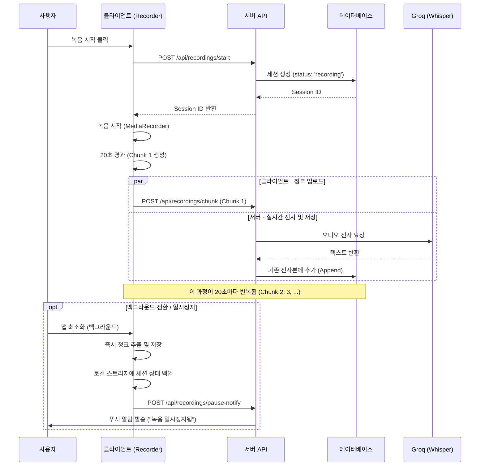
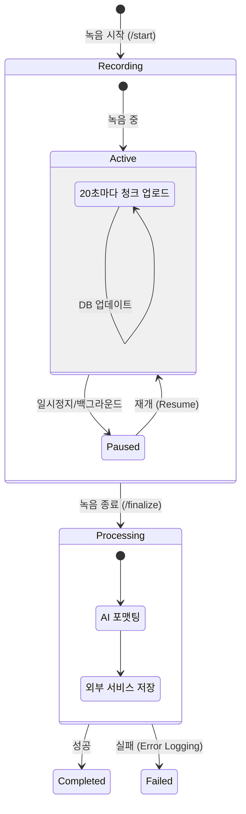
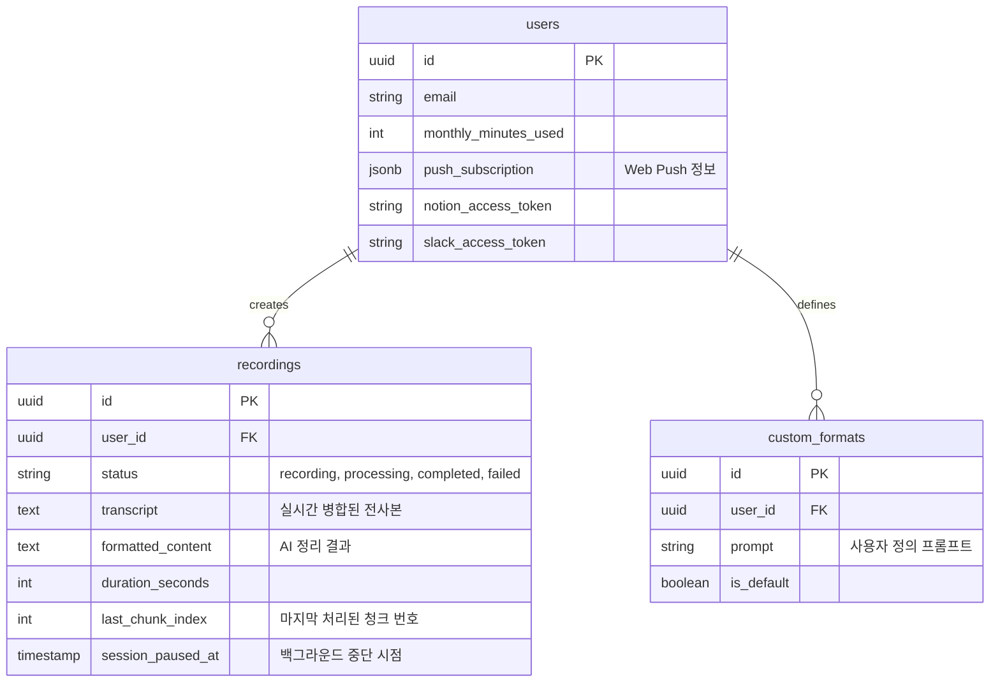

# 서비스 로직 흐름도 (Service Logic Flow)

이 문서는 Archy 서비스의 핵심 로직을 시각화한 자료입니다.

## 1. 시스템 아키텍처 (System Architecture)

서비스의 전반적인 구조와 외부 서비스와의 연동 관계입니다.

```mermaid
graph TD
    subgraph Client [클라이언트 (PWA/Web)]
        UI[사용자 인터페이스]
        Recorder[청크 기반 녹음기 (useChunkedRecorder)]
        Storage[로컬 스토리지 (세션 복구용)]
        WakeLock[Wake Lock & 오디오 Keep-Alive (iOS)]
    end

    subgraph Server [서버 (Next.js API & Supabase)]
        API_Start[/api/recordings/start]
        API_Chunk[/api/recordings/chunk]
        API_Finalize[/api/recordings/finalize]
        API_Auth[/api/auth/*]
        DB[(Supabase DB)]
    end

    subgraph AI_Services [AI 서비스]
        Groq[Groq (Whisper V3) - STT]
        OpenAI[OpenAI (GPT-4o-mini) - 요약/포맷팅]
    end

    subgraph Integrations [외부 연동]
        Notion[Notion API]
        Slack[Slack API]
        Google[Google Docs API]
        Push[Web Push API]
    end

    %% 흐름 연결
    UI --> Recorder
    Recorder <--> Storage
    Recorder --> API_Start
    Recorder -- "20초마다 오디오 청크 전송" --> API_Chunk
    Recorder --> API_Finalize
    
    API_Start --> DB
    API_Chunk --> Groq
    Groq -- "텍스트 변환" --> API_Chunk
    API_Chunk -- "실시간 전사본 병합(Append)" --> DB
    
    API_Finalize --> DB
    API_Finalize --> OpenAI
    OpenAI --> Integrations
    API_Finalize --> Push
```

---

## 2. 녹음 및 실시간 전사 프로세스 (Recording & Real-time Transcription)

사용자가 녹음을 시작하고, 오디오가 청크 단위로 처리되어 저장되는 과정입니다.



---

## 3. 녹음 종료 및 데이터 처리 파이프라인 (Finalization & Processing)

녹음이 종료된 후, 최종 문서를 생성하고 외부 서비스로 전송하는 과정입니다.

```mermaid
flowchart TD
    Start([녹음 종료 요청]) --> UploadLast[마지막 청크 업로드]
    UploadLast --> FinalizeCall[API 호출: /finalize]
    
    subgraph Server_Processing [서버 처리 과정]
        FinalizeCall --> Validate[세션 및 사용량 검증]
        Validate --> UpdateStatus[상태 변경: processing]
        UpdateStatus --> FetchTranscript[DB에서 전체 전사본 조회]
        
        FetchTranscript --> AI_Format[AI 문서 정리 (GPT-4o-mini)]
        note1[회의록/인터뷰/강의 등<br/>선택된 포맷 적용] -.-> AI_Format
        
        AI_Format --> SaveDB[정리된 내용 DB 저장]
        
        SaveDB --> CheckInteg{연동 서비스 확인}
        
        CheckInteg -->|Notion 연결됨| SaveNotion[Notion 페이지 생성]
        CheckInteg -->|Google Docs 연결됨| SaveGoogle[Google Docs 생성]
        CheckInteg -->|Slack 연결됨| SendSlack[Slack 알림 발송]
        
        SaveNotion & SaveGoogle & SendSlack --> Complete[완료 처리]
        
        Complete --> Push[PWA 푸시 알림 발송]
    end
    
    Push --> End([종료])
```

## 4. 데이터 상태 전이 (State Transition)

녹음 세션의 생명주기입니다.



---

## 5. 데이터베이스 구조 (Entity Relationship Diagram)

서비스에서 사용하는 데이터 모델의 관계도입니다. AI가 데이터 흐름을 이해하는 데 핵심적인 정보입니다.



---

## 6. 에러 복구 및 재시도 로직 (Error Recovery & Retry Logic)

네트워크 불안정 상황에서의 데이터 무결성 보장 메커니즘입니다. 이 부분은 시스템의 안정성을 시각화할 때 중요합니다.

```mermaid
flowchart TD
    subgraph Client_Side [클라이언트: ChunkUploadManager]
        GenChunk[청크 생성 (20초)] --> Enqueue[대기열 추가]
        Enqueue --> CheckNet{네트워크 상태}
        
        CheckNet -->|Online| Attempt[업로드 시도]
        CheckNet -->|Offline| PauseQueue[대기열 일시정지]
        
        Attempt -->|Success| Dequeue[대기열 제거 & 다음 청크]
        Attempt -->|Fail| RetryCount{재시도 < 5회?}
        
        RetryCount -->|Yes| Backoff[지수 백오프 대기 (1s~30s)]
        Backoff --> Attempt
        
        RetryCount -->|No| MarkFail[개별 청크 실패 처리]
        
        PauseQueue --> DetectOnline{온라인 복구 감지}
        DetectOnline -->|Yes| ResumeQueue[대기열 재개 (재시도)]
    end
```

## 7. 다이어그램 생성용 프롬프트 요약 (Prompt Summary)

AI 드로잉 툴(Napkin, Miro AI 등)에 입력하기 좋은 자연어 설명입니다.

> **시스템 설정:** 사용자가 웹/PWA 환경에서 녹음 버튼을 누르면 브라우저의 마이크 권한을 얻어 녹음을 시작합니다.
> **녹음 프로세스:** 오디오는 20초마다 잘게 쪼개져(Chunking) 서버로 실시간 전송됩니다. 서버는 즉시 Groq Whisper API를 통해 텍스트로 변환하고, 데이터베이스의 `transcript` 필드에 이어붙입니다(Append).
> **안정성:** 만약 사용자가 앱을 닫거나 백그라운드로 가면, `pause-notify` API를 호출하고 로컬 스토리지에 세션 ID를 저장해 나중에 이어할 수 있게 합니다. 네트워크가 끊기면 클라이언트는 최대 5회까지 지수 백오프(Exponential Backoff)로 재시도를 수행합니다.
> **완료 처리:** 녹음이 끝나면 사용자는 `/finalize`를 요청합니다. 서버는 GPT-4o-mini를 사용해 모인 텍스트를 회의록 등의 포맷으로 정리하고, 사용자가 미리 연결해둔 Notion, Google Docs로 문서를 보내고 Slack으로 알림을 발송합니다.

