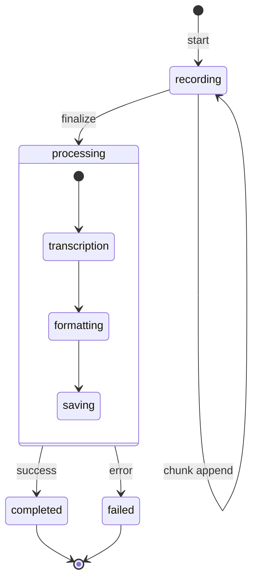
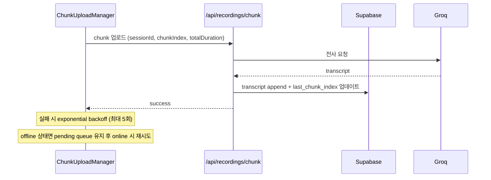
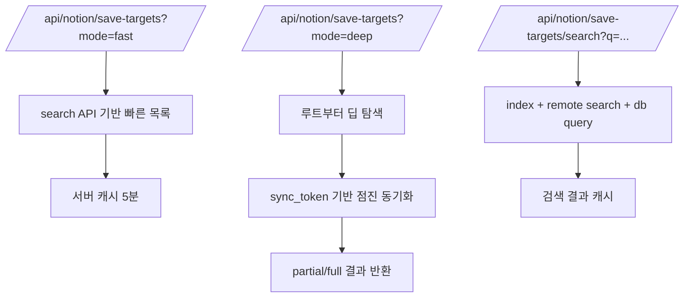

# Archy 서비스 흐름

최종 업데이트: 2026-02-24

## 1. End-to-End 파이프라인

```mermaid
flowchart TD
    A[사용자 녹음 시작] --> B[/api/recordings/start]
    B --> C[(recordings: status=recording)]

    C --> D[20초 청크 생성]
    D --> E[/api/recordings/chunk]
    E --> F[Groq Whisper V3]
    F --> G[(transcript append + last_chunk_index 업데이트)]

    G --> H[녹음 종료]
    H --> I[/api/recordings/finalize]
    I --> J[transcript 안정화 대기]
    J --> K[(status=processing, processing_step=transcription)]
    K --> L[OpenAI gpt-4o-mini 포맷팅]
    L --> M[(formatted_content + title 저장)]
    M --> N[(processing_step=saving)]

    N --> O{외부 연동}
    O -->|Notion 연결| P[Notion 페이지/DB 저장]
    O -->|Google 연결| Q[Google Docs 생성]
    O -->|Slack 연결| R[Slack 알림]

    P --> S[(status=completed)]
    Q --> S
    R --> S
    S --> T[Web Push 알림]
```

## 2. 세션/상태 전이

```mermaid
stateDiagram-v2
    [*] --> recording: start
    recording --> recording: chunk append
    recording --> processing: finalize

    state processing {
      [*] --> transcription
      transcription --> formatting
      formatting --> saving
    }

    processing --> completed: success
    processing --> failed: error
    completed --> [*]
    failed --> [*]
```

## 3. 청크 업로드 복구 로직

```mermaid
sequenceDiagram
    participant Client as ChunkUploadManager
    participant API as /api/recordings/chunk
    participant DB as Supabase
    participant STT as Groq

    Client->>API: chunk 업로드 (sessionId, chunkIndex, totalDuration)
    API->>STT: 전사 요청
    STT-->>API: transcript
    API->>DB: transcript append + last_chunk_index 업데이트
    API-->>Client: success

    Note over Client: 실패 시 exponential backoff (최대 5회)
    Note over Client: offline 상태면 pending queue 유지 후 online 시 재시도
```

## 4. Notion 저장 대상 탐색

```mermaid
flowchart TD
    A[/api/notion/save-targets?mode=fast/] --> B[search API 기반 빠른 목록]
    B --> C[서버 캐시 5분]

    D[/api/notion/save-targets?mode=deep/] --> E[루트부터 딥 탐색]
    E --> F[sync_token 기반 점진 동기화]
    F --> G[partial/full 결과 반환]

    H[/api/notion/save-targets/search?q=.../] --> I[index + remote search + db query]
    I --> J[검색 결과 캐시]
```

## 5. 실패 처리 기준

- `transcription` 실패: STT 오류/빈 결과
- `formatting` 실패: OpenAI 타임아웃 또는 재시도 초과
- `notion`/`google`/`slack` 실패: 연동 실패를 `error_step`/`error_message`에 기록
- 치명 오류: `handleProcessingError`에서 `status=failed`, `error_step=upload` 처리
