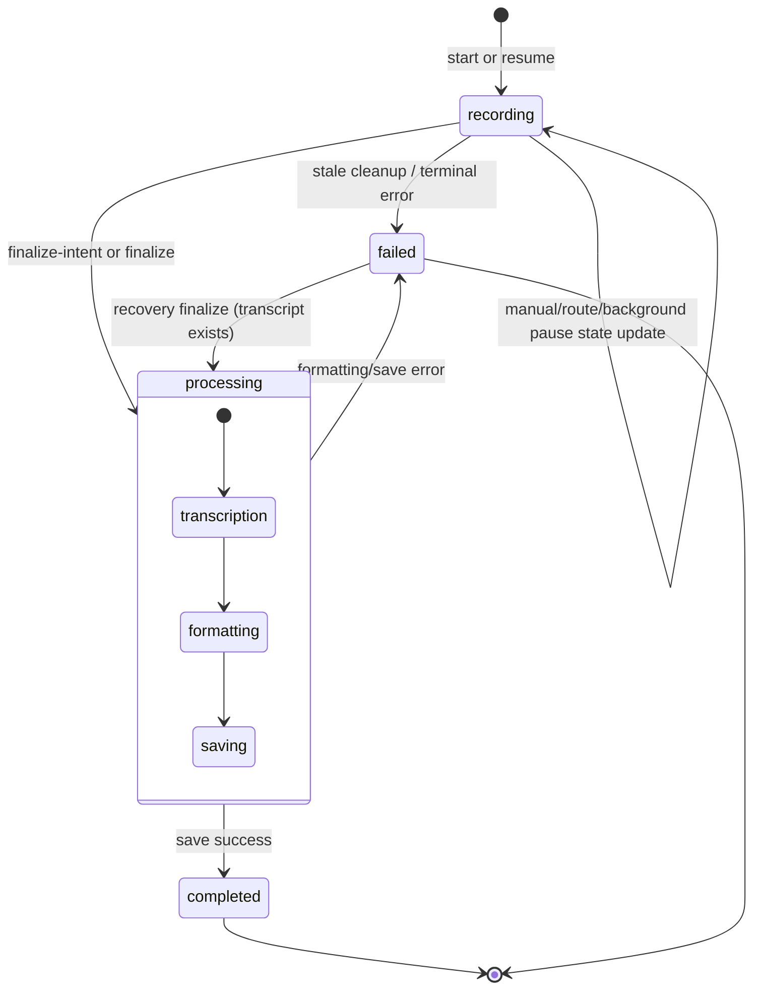
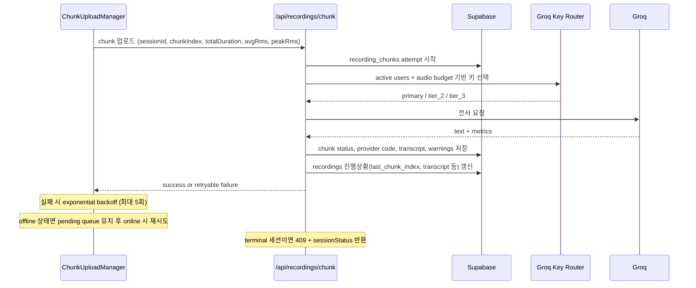
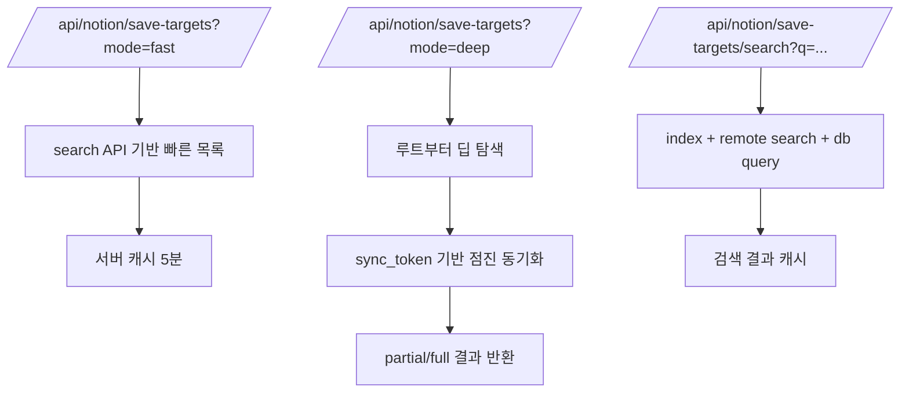

# Archy 서비스 흐름

최종 업데이트: 2026-03-12

## 1. End-to-End 파이프라인

```mermaid
flowchart TD
    A[사용자 녹음 시작] --> B[/api/recordings/start]
    B --> C[(recordings: status=recording)]

    C --> D[20초 청크 생성]
    D --> E[/api/recordings/chunk]
    E --> F{Pre-gate}
    F -->|low RMS or too small| G[skip / likely silence]
    F -->|normal| H[Groq Whisper V3]
    H --> I[후처리 필터: silence / hallucination / repetition]
    G --> J[(recording_chunks upsert)]
    I --> J
    J --> K[(last_chunk_index / last_activity_at / transcript 갱신)]

    K --> L{사용자 상태}
    L -->|background / route leave| M[/api/recordings/pause-notify]
    M --> C
    L -->|resume| B
    L -->|stop| N[/api/recordings/finalize-intent]

    N --> O[after() background finalize]
    O --> P[transcript 안정화 대기]
    P --> Q[(status=processing)]
    Q --> R[Gemini 3.1 Pro Preview 포맷팅, 2026-05-06 KST 이후 OpenAI gpt-4o-mini 복귀]
    R --> S[(formatted_content + title 저장)]
    S --> T[(processing_step=saving)]

    T --> U{외부 연동}
    U -->|Notion| V[page/db 저장]
    U -->|Google| W[Docs 생성]
    U -->|Slack| X[알림 전송]
    V --> Y[(status=completed)]
    W --> Y
    X --> Y
    Y --> Z[Web Push]
```

## 2. 세션/상태 전이

```mermaid
stateDiagram-v2
    [*] --> recording: start or resume
    recording --> recording: chunk append
    recording --> recording: manual/route/background pause state update
    recording --> processing: finalize-intent or finalize

    state processing {
      [*] --> transcription
      transcription --> formatting
      formatting --> saving
    }

    processing --> completed: save success
    recording --> failed: stale cleanup / terminal error
    processing --> failed: formatting/save error
    failed --> processing: recovery finalize (transcript exists)
    completed --> [*]
    failed --> [*]
```

## 3. 청크 업로드 및 품질 추적

```mermaid
sequenceDiagram
    participant Client as ChunkUploadManager
    participant API as /api/recordings/chunk
    participant DB as Supabase
    participant Router as Groq Key Router
    participant STT as Groq

    Client->>API: chunk 업로드 (sessionId, chunkIndex, totalDuration, avgRms, peakRms)
    API->>DB: recording_chunks attempt 시작
    API->>Router: active users + audio budget 기반 키 선택
    Router-->>API: primary / tier_2 / tier_3
    API->>STT: 전사 요청
    STT-->>API: text + metrics
    API->>DB: chunk status, provider code, transcript, warnings 저장
    API->>DB: recordings 진행상황(last_chunk_index, transcript 등) 갱신
    API-->>Client: success or retryable failure

    Note over Client: 실패 시 exponential backoff (최대 5회)
    Note over Client: offline 상태면 pending queue 유지 후 online 시 재시도
    Note over API: terminal 세션이면 409 + sessionStatus 반환
```

## 4. finalize-intent 와 finalize 폴백

```mermaid
flowchart TD
    A[사용자 stop] --> B[/api/recordings/finalize-intent]
    B --> C[202 Accepted]
    C --> D[Next after() background finalize]
    D --> E{성공?}
    E -->|yes| F[processing -> completed]
    E -->|no or unsupported| G[/api/recordings/finalize]
    G --> H[동기 finalize / transcript 기반 복구]
    H --> F
```

## 5. stale recording 정리

```mermaid
flowchart TD
    A[Scheduler / manual call] --> B[/api/cron/stale-recordings]
    B --> C[CRON_SECRET 검증]
    C --> D[status=recording and last_activity_at < 30m 조회]
    D --> E{transcript 존재 & formatted_content 없음?}
    E -->|yes| F[failed + degraded + stale_timeout_recovery_candidate]
    E -->|no| G[failed + abandoned]
    F --> H[나중에 finalize 복구 가능]
    G --> I[종료]
```

## 6. Notion 저장 대상 탐색

```mermaid
flowchart TD
    A[/api/notion/save-targets?mode=fast/] --> B[search API 기반 빠른 목록]
    B --> C[서버 캐시 5분]

    D[/api/notion/save-targets?mode=deep/] --> E[루트부터 딥 탐색]
    E --> F[sync_token 기반 점진 동기화]
    F --> G[partial/full 결과 반환]

    H[/api/notion/save-targets/search?q=.../] --> I[index + remote search + db query]
    I --> J[검색 결과 캐시]
```

## 7. 실패 처리 기준

- `transcription` 실패: STT 오류, chunk 누락, recoverable retry 소진
- `formatting` 실패: 활성 formatting provider(Gemini/OpenAI) 타임아웃 또는 문제 응답 재시도 초과
- `notion` / `google` / `slack` 실패: 연동 실패를 `error_step` / `error_message`에 기록
- `abandoned` 실패: 30분 이상 비활성 세션이 stale cleanup에 걸린 경우
- 클라이언트 오류: `/api/client-errors`로 recorder 상태와 함께 별도 로깅
